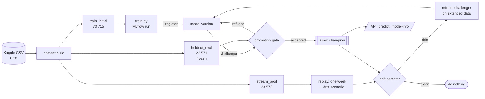

# mlops-car-price

[](https://github.com/P0w3r223/mlops-car-price/actions/workflows/ci.yml)

**Keeping a model alive instead of just training one.** This repository is the MLOps layer
around the used-car price model from
[car-price-ml](https://github.com/P0w3r223/car-price-ml): versioned data, recorded
training runs, drift monitoring on simulated production traffic, and a promotion rule
that decides — on evidence — when a challenger may replace the champion.

> **Complete.** Data versioning, MLflow tracking, the model registry, the statistical
> promotion gate, drift monitoring with an evaluated detector, the retraining loop and the
> versioned API are all in place. Further ideas live in the issues, labelled `roadmap`.

## The problem

A model that scores well offline is not a system. The questions this project answers are
the ones that come *after* the notebook:

- Which exact rows produced this number, and can I get them back?
- Has the incoming data moved away from what the model was trained on — and is that
  "movement" real or just noise from a large sample?
- A new model looks better by 370 PLN. Is that an improvement, or a coin flip?
- What is deployed right now, and what does it cost to keep replacing it?

## Architecture

```
configs/config.yaml        every threshold, proportion and path
src/mlops_car_price/
  config.py                YAML -> frozen dataclasses, validated on load
  dataset.py               three-way split + content manifest (the data version)
  tracking.py              MLflow wiring: tracking URI, experiment, client
  registry.py              versions and the champion/challenger aliases
  replay.py                weekly "production" snapshots + named drift scenarios
  drift/metrics.py         PSI, Wasserstein, KS, chi-square, missing rates
  drift/detector.py        thresholds and calibration -> a verdict with reasons
  drift/evaluate.py        false alarms and power, three detectors on identical data
  drift/report.py          the verdict as markdown
  training/train.py        the only path to a trained model; one run = one record
  training/promote.py      the gate: score, judge, move the alias, record why
  training/retrain.py      the loop: notice, retrain, judge, usually do nothing
  api/main.py              serves whatever the champion alias points at
examples/                  scripts that regenerate the tables below
Dockerfile, docker-compose.yml   the registry and the service, wired together
```

The modelling code is not reimplemented here. `car_price_ml` is installed as a dependency
pinned to tag `v0.1.1` and supplies cleaning, feature engineering, the models and the
metrics. This repo owns everything around the model — which is what "MLOps" means here.



### The data split

The source is the open Kaggle dataset `aleksandrglotov/car-prices-poland` (CC0). It is
cleaned by A3's own code and split once, deterministically:

| Split | Rows | Purpose |
|---|---:|---|
| `train_initial` | 70 715 | what the first champion is trained on |
| `holdout_eval` | 23 571 | **frozen** — every champion/challenger comparison uses these exact rows |
| `stream_pool` | 23 573 | never trained on; becomes weekly "production" snapshots |

Each split is hashed into `data/processed/manifest.json`, and the hash of that manifest is
stamped on every training run. Two runs carrying the same dataset hash saw byte-identical
data — which is the only condition under which comparing them means anything.

## What a model costs to operate

Accuracy is one column. Trained on `train_initial`, scored on the frozen holdout, seed 42
(regenerate with `python examples/artifact_cost.py`):

| Model | Holdout MAE | Train | Artifact | Load | Predict p50 | Predict p95 | Batch | Registry / year |
|---|---:|---:|---:|---:|---:|---:|---:|---:|
| Ridge | 15 422 PLN | 0.1 s | 0.0 MB | 0.00 s | 5.1 ms | 6.1 ms | 728k rows/s | 0.0 GB |
| LightGBM | 9 278 PLN | 1.7 s | 3.3 MB | 0.03 s | 12.9 ms | 13.7 ms | 119k rows/s | 0.2 GB |
| RandomForest | 8 908 PLN | 7.8 s | 338.5 MB | 0.44 s | 47.1 ms | 68.2 ms | 148k rows/s | 17.2 GB |

RandomForest is 370 PLN (4.0%) better and costs 103× the storage, 5× the p95 request
latency and 17.2 GB of registry a year at one retraining a week. So the deployment budget
is enforced by the gate, not by a paragraph — the real candidate was refused:

```
[promote] candidate v2 (RandomForest): MAE 8908.2 PLN
[promote] champion  v1 (LightGBM): MAE 9278.0 PLN
[promote] reason: artifact is 338.5 MB, over the 50.0 MB deployment budget
[promote] REJECTED - candidate v2, delta +369.8 PLN
```

## Watching the model age

Fresh listings cannot be collected legally (ADR 0002), so a week of "production traffic" is
a draw from `stream_pool` — never trained on, never evaluated on — optionally put through a
named scenario. Three monitors then watch the same week, and they disagree on purpose
(regenerate with `python examples/drift_scenarios.py`):

| Scenario | What breaks | Feature drift | Prediction drift | MAE change | Alert |
|---|---|---|---|---:|---|
| `stable` | no change; the control case | - | no | -0.9% | no |
| `price_shock` | prices inflate, features unchanged | - | no | **+135.2%** | **yes** |
| `fuel_mix_shift` | more electric and hybrid cars | age, mileage, vol_engine, model, fuel | yes | +2.1% | **yes** |
| `mileage_shift` | higher mileage across the week | mileage | no | +24.5% | **yes** |
| `unseen_makes` | makes absent from the training data | mark | no | +7.5% | **yes** |
| `missing_engine_volume` | engine volume arrives empty | vol_engine | no | +26.1% | **yes** |

Two rows carry the argument for paying for all three monitors:

- **`price_shock`** moves the target and nothing else. Every feature is untouched, so feature
  drift is silent; the inputs are unchanged, so the predictions are identical and prediction
  drift is silent too. Only the realised error sees it — **+135%** — and in a real system that
  signal arrives last, because labels are late.
- **`fuel_mix_shift`** is the mirror image: five features flagged, predictions flagged, and the
  model is **2.1% worse**. Drift is not degradation. A monitor that only knows how to say
  "the data moved" will page someone for this.

## The detector is measured, not trusted

A monitor is a classifier with two error rates, and shipping one without measuring them is
how alerting turns into noise. Three detectors are run on identical snapshots — the textbook
fixed thresholds, the calibrated version this project uses, and a KS p-value gate as the arm
to beat (`python examples/detector_evaluation.py`, 200 snapshots per cell):

**False alarms on weeks where nothing happened.** Every figure here is an error.

| Rows in snapshot | fixed thresholds | calibrated (this project) | KS p-value |
|---|---:|---:|---:|
| 250 | 100.0% | 5.0% | 13.5% |
| 500 | 100.0% | 7.5% | 17.5% |
| 1 000 | 99.0% | **0.0%** | 20.0% |
| 2 000 | 0.0% | **0.0%** | 13.5% |
| 5 000 | 0.0% | **0.0%** | 42.5% |

**The same negligible shift at growing sample sizes** — `mileage_shift` of 0.05 standard
deviations, a change nobody would retrain for. The shift never changes; only `n` does.

| Rows in snapshot | fixed thresholds | calibrated (this project) | KS p-value |
|---|---:|---:|---:|
| 250 | 100.0% | 11.0% | 16.5% |
| 500 | 100.0% | 17.0% | **100.0%** |
| 1 000 | 99.5% | 13.0% | **100.0%** |
| 2 000 | 1.5% | 1.5% | **100.0%** |
| 5 000 | 0.0% | 0.0% | **100.0%** |

That is the p-value trap with a number on it: from 500 rows upward the significance test is
*certain* about a shift too small to act on, and it grows more certain as the data grows.
The effect-size detectors move the other way — with more rows the estimate settles below the
threshold, which is the correct answer.

And calibration is not paid for in power: across every magnitude of every scenario the
calibrated detector matched the fixed one exactly (0.05σ mileage: 4% both; 0.1σ: 100% both;
2% unseen makes: 3% both; 5%: 100% both). It removes the false alarms and detects the same
real shifts — full tables in [`reports/detector_evaluation.md`](reports/detector_evaluation.md).

## Why the textbook PSI threshold does not work

The first monitoring run flagged drift on the **control snapshot** — a week with nothing
changed. The culprit is the received wisdom that PSI above 0.2 means drift:

| Feature | Categories | PSI on an unshifted week | PSI from noise alone (99th pct) |
|---|---:|---:|---:|
| age | numeric | 0.002 | 0.009 |
| fuel | 6 | 0.000 | 0.006 |
| mark | ~30 | 0.013 | 0.017 |
| **model** | **~200** | **0.140** | **0.169** |

PSI is an effect size, but its null distribution still depends on sample size and category
count. For `age` the 0.2 threshold sits 22× above the noise; for `model` the noise alone eats
0.169 of it. Shrink the sample and it breaks outright: 200 categories drawn at 500 rows score
**PSI 0.36 against their own source**.

So a column is flagged only when it clears **both** the configured threshold ("is this worth
acting on?") and its own measured noise floor ("is this more than the column does by itself?"),
where the floor comes from resampling the reference at the snapshot's size
([ADR 0006](docs/decisions/0006-calibrated-drift-thresholds.md)). p-values are reported for
every column and gate nothing — at these sample sizes they measure n, not drift.

## The bug this project found in its own foundation

Two runs of the same model, same seed, same rows, kept disagreeing:

```
RandomForest, random_state=42: 8841.2 PLN, then 8914.1 PLN
LightGBM,     random_state=42: 9331.0 / 9266.7 / 9278.2 PLN
```

The estimators were seeded; the **preprocessing was not**. A3's target encoder shuffled its
internal cross-fitting folds from an unseeded RNG, so identical data produced different
encodings. A ~70 PLN spread is nothing next to a 9 000 PLN MAE — and everything next to a
100 PLN promotion margin. The gate would have been reading noise part of the time.

Fixed upstream in [car-price-ml#3](https://github.com/P0w3r223/car-price-ml/pull/3)
(v0.1.1), not worked around here ([ADR 0004](docs/decisions/0004-reproducibility-fixed-upstream.md)).
Runs now reproduce to the decimal. The dataset hash changed with the pin, which is exactly
what a data version should do when the code that cleans the data changes.

## How a model reaches production

```bash
python -m mlops_car_price.training.train --model LightGBM --register  # -> version, alias challenger
python -m mlops_car_price.training.promote --version 1                # -> judged, alias moved
python -m mlops_car_price.replay --week 1 --scenario price_shock      # -> a week of traffic
python -m mlops_car_price.drift.detector --week 1 --scenario price_shock
```

Registering is proposing, not deploying. The gate scores the candidate **and** the current
champion on the frozen holdout and refuses unless every rule passes: a holdout large enough
to judge on, an artifact that reproduces the MAE its own run recorded, the deployment budget,
the same dataset version on both sides, an improvement past the configured margin, and an
improvement that survives a paired bootstrap. Serving code asks for
`models:/car-price@champion` and never names a version.

### Is a 370 PLN improvement real, or is it luck?

The last two rules answer different questions — "is this worth the swap?" and "could this be
sampling noise?" — and either alone promotes the wrong thing. The second is a **paired**
bootstrap, because champion and challenger score the *same* cars:

| | 95% interval for the improvement | width | p |
|---|---|---:|---:|
| paired | (+264.4, +474.9) PLN | 210.5 | 0.0002 |
| unpaired | (+28.3, +715.2) PLN | 686.8 | 0.0342 |

The per-row errors correlate at **0.906** — the same unusual cars are hard for both models.
Ignoring that makes the interval **3.3× wider** and drops its lower bound to +28 PLN, a hair
from zero: on a slightly smaller holdout the independent-samples tool would have refused a
model that is genuinely better. The paired bootstrap did not exist in
[ab-lab](https://github.com/P0w3r223/ab-lab), so it was added there (0.2.0) rather than
written a second time here.

So the RandomForest advantage **is real** — and it is still refused, by the deployment budget.
The system now states an explicit trade: a genuine 4% accuracy gain, declined because a
338 MB artifact cannot be retrained weekly and kept in a registry.

## The loop, and how often it should do nothing

```bash
python -m mlops_car_price.training.retrain --weeks 11 --scenario mileage_shift
```

A quiet week ends the pass immediately — retraining on data that has not moved burns compute
and hands the gate a coin flip to judge:

```
[retrain] week 10 / stable: clean
[retrain] no retraining - no drift across 1 week(s) - the champion still fits the traffic
```

A drifted week trains a challenger on the original data **plus** the weeks that have arrived,
registers it as a candidate, and lets the gate rule:

```
[retrain] week 11 / mileage_shift: DRIFT
[retrain]   feature 'mileage': PSI 0.783 over 0.200
[retrain]   error: MAE up 15.9% on the week (limit 10.0%)
[retrain] challenger v3: MAE 9362.7 PLN
[retrain]   MAE improves by -84.7 PLN, short of the required 100.0 PLN
[retrain] champion is now v1
```

The challenger came out **worse** and was refused — which is the realistic outcome, not a
failure of the loop. Two thousand new rows are 2.8% of the training set; one week of drifted
traffic does not undo a covariate shift, it only dilutes it. A retraining loop whose
challengers are always promoted is not a quality bar, it is a deployment script with extra
steps.

## Serving the champion

The service never names a model version. It resolves `models:/car-price@champion` at startup,
so promoting a different version and restarting *is* the deployment — the image contains no
model and this repository does not change when the model does ([ADR 0008](docs/decisions/0008-serving-an-alias.md)).

```bash
docker compose up -d mlflow
docker compose --profile bootstrap run --rm bootstrap   # build splits, train, promote
docker compose up -d api
curl localhost:8000/model-info
```

```json
{"version":"1","model_name":"LightGBM","holdout_mae":9278.0,
 "dataset_hash":"5bde21653f15...","car_price_ml_version":"0.1.1",
 "promotion_reason":"no champion registered yet - the first valid candidate takes the alias",
 "trained_at":"2026-07-22T16:06:05.961000+00:00"}
```

`POST /predict` answers with the price and echoes `X-Model-Version`, so a prediction can be
traced to the model that made it after the alias has moved on. `GET /health` reports
**degraded** rather than crash-looping when no champion exists — that is what a fresh
environment looks like, not a failure. The tracking server owns the artifacts
(`--serve-artifacts`), so the API fetches the champion over HTTP and shares no filesystem
with it.

The containerised run reproduces the host exactly: same 9 278.0 PLN holdout MAE, same
35 772.63 PLN valuation for the same car.

## Run it locally

```bash
python -m venv .venv && .venv/Scripts/python -m pip install -e ".[dev]"
kaggle datasets download -d aleksandrglotov/car-prices-poland -p data/raw --unzip
python -m mlops_car_price.dataset build && python -m mlops_car_price.training.train --register
```

Then `mlflow ui --backend-store-uri sqlite:///mlflow.db` to inspect runs and versions, or
`python -m mlops_car_price.training.retrain --weeks 1` to run one pass of the maintenance loop.

## Technical decisions

Full context in [`docs/decisions/`](docs/decisions/).

- **[ADR 0001](docs/decisions/0001-consume-car-price-ml-as-a-package.md) — the modelling
  code is a dependency, not a copy.** A3 is installed from a git tag, so a run is
  reproducible against a fixed modelling version and there is exactly one definition of
  "clean the data".
- **[ADR 0002](docs/decisions/0002-replay-instead-of-a-scraper.md) — production traffic is
  a replay, not a scraper.** A3 rejected scraping the Polish listing sites (database
  *sui generis* right, ToS), and that decision does not expire because a later project
  would find fresh data convenient.
- **[ADR 0003](docs/decisions/0003-lightgbm-as-the-production-model.md) — LightGBM serves,
  and the budget is in the gate.** The offline winner is not automatically the model a
  maintenance loop can carry; 0.23 pp of MAPE bought two orders of magnitude on every
  operation the loop performs.
- **[ADR 0004](docs/decisions/0004-reproducibility-fixed-upstream.md) — the determinism bug
  was fixed in A3, not patched around here.** Duplicating the preprocessing would have
  defeated the point of consuming it as a package.
- **[ADR 0005](docs/decisions/0005-own-drift-metrics-evidently-as-oracle.md) — the drift
  metrics are implemented here; Evidently referees them offline.** It costs 41 transitive
  packages and a 6-second import to render HTML this project renders as markdown — but it
  agrees with our numbers to five decimals, and that agreement is a test.
- **[ADR 0006](docs/decisions/0006-calibrated-drift-thresholds.md) — thresholds are
  calibrated against the null.** A fixed PSI cutoff alarms on unshifted data whenever a
  column has many categories or the sample is small.
- **[ADR 0007](docs/decisions/0007-statistical-promotion-gate.md) — a challenger must beat
  the champion by more than sampling noise.** Paired, because both models score the same
  cars; ignoring that correlation widens the interval 3.3× and nearly hides a real gain.
- **[ADR 0008](docs/decisions/0008-serving-an-alias.md) — the service resolves an alias and
  starts degraded rather than not at all.** Deployment and promotion become separate acts;
  a fresh environment with no champion is a normal state, not a crash loop.
- **SQLite, not a file store, for MLflow.** The model registry does not exist on a file
  backend — a constraint that only surfaces at `register_model` time.
- **Drift gates on effect size, not p-values.** Measured rather than asserted: a KS gate
  reaches 100% detection on a shift too small to act on, purely by growing `n`.

## Limitations

Written after building it, not before.

- **The production stream is simulated.** The drift scenarios are named, parameterised and
  documented, but they are generated, not observed. Nothing here proves the model degrades on
  the real 2026 Polish market — only that the system detects and reacts to degradation when it
  happens.
- **The source dataset has no listing date.** "Weeks" are a replay construct; the split is
  random, not chronological, so genuine temporal drift and seasonality are out of reach.
- **Prices are historical** (dataset vintage ~2021) and `age` comes from a fixed reference
  year inherited from A3, so the absolute złoty figures are not today's market.
- **Nothing runs on a schedule.** The loop works end to end locally and in containers, but a
  weekly CI run would need the Kaggle source, which is not in the repository. A green badge on
  fabricated data would be worse than no badge ([issue #10](https://github.com/P0w3r223/mlops-car-price/issues/10)).
- **The dataset hash is environment-sensitive.** It covers the bytes *as this environment
  serialises them*, so a different pyarrow version produces a different hash for identical
  rows. That makes the gate refuse to compare across environments — conservative, and worth
  knowing before it surprises someone.
- **Picking up a new champion requires a restart.** Deliberate: a hot-reload endpoint would let
  the serving version change underneath a running experiment.
- **The promotion gate answers sampling variation, not fitness for the future.** The interval
  is computed on one frozen holdout; whether that holdout still resembles next month's traffic
  is what the drift monitoring is for.

## What I would do differently

- **Test reproducibility on day one.** The seeded-preprocessing bug (ADR 0004) sat under three
  sessions of work and was the same order as the promotion margin it would have corrupted.
- **Distrust a threshold before shipping it.** The calibration work (ADR 0006) came from a
  detector firing on the control case; the evaluation harness that should have caught it
  existed only one session later.
- **Expect the installed package to behave differently.** ADR 0001 documents this trap for the
  modelling layer, and this package still walked into it — the config default resolved inside
  `site-packages` the first time it ran from a container.

## Licence

MIT. Source data: `aleksandrglotov/car-prices-poland` (CC0-1.0).
